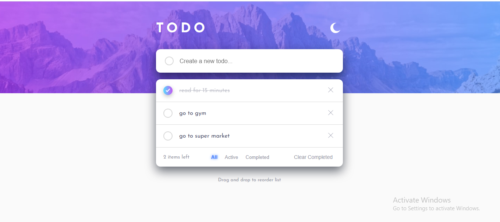

<h1 align="center">📝 Todo App</h1>

A beautifully designed, fully functional <strong>Todo Application</strong> built using <strong>HTML</strong>, <strong>CSS</strong>, and <strong>JavaScript (Modules)</strong>.  
It features local storage support, drag & drop reordering, light/dark theme toggle, and responsive behavior across all devices.  
This project focuses on clean design, dynamic interactivity, and smooth user experience. ✨

<h2>📸 Preview</h2>

  
    
  

<h2>🚀 Features</h2>
<ul>
  <li>🌗 <strong>Light / Dark Theme Toggle</strong> with smooth transitions</li>
  <li>💾 <strong>Local Storage Integration</strong> – keeps your todos even after reloading</li>
  <li>📋 <strong>Todo CRUD Functionality</strong> – add, mark complete, delete, and clear completed</li>
  <li>🏷️ <strong>Filter System</strong> – show <em>All</em>, <em>Active</em>, or <em>Completed</em> tasks</li>
  <li>🖱️ <strong>Drag & Drop Reordering</strong> of todo items</li>
  <li>📱 <strong>Fully Responsive Design</strong> – optimized for desktop, tablet, and mobile</li>
  <li>🎨 <strong>Modern UI</strong> with soft shadows, gradients, and hover animations</li>
  <li>⚙️ <strong>Modular JavaScript Structure</strong> using ES6 modules</li>
  <li>💡 <strong>Accessibility Ready</strong> – ARIA labels and keyboard-friendly design</li>
  <li>🧠 <strong>Clean & Organized Codebase</strong> with comments and reusable components</li>
</ul>

<h2>🛠️ Tech Stack</h2>
<ul>
  <li>📄 <strong>HTML5</strong> – Semantic and accessible structure</li>
  <li>🎨 <strong>CSS3</strong> – Flexbox, Grid, transitions, keyframes, and media queries</li>
  <li>⚡ <strong>JavaScript (ES6 Modules)</strong> – Modular, organized logic</li>
  <li>💾 <strong>Local Storage API</strong> – Data persistence</li>
  <li>🎯 <strong>Drag & Drop API</strong> – Native browser interaction for reordering</li>
</ul>

<h2>🧪 How to Run</h2>
<ol>
  <li>📥 Clone or download this repository</li>
  <li>📂 Open the project folder in your editor</li>
  <li>🌍 Open <code>index.html</code> in your browser</li>
  <li>✅ Enjoy the full Todo experience – add, complete, reorder, and filter tasks</li>
</ol>

<h2>💬 Contact</h2>

📧 Email: <a href="mailto:yousseftalaat142@gmail.com">yousseftalaat142@gmail.com</a>

🔗 LinkedIn: <a href="https://www.linkedin.com/in/youssef-talaat-1aa2671b3/">Youssef Talaat</a>

---

<h3 align="center">✨ Created & Maintained by <strong>Youssef Talaat</strong></h3>
